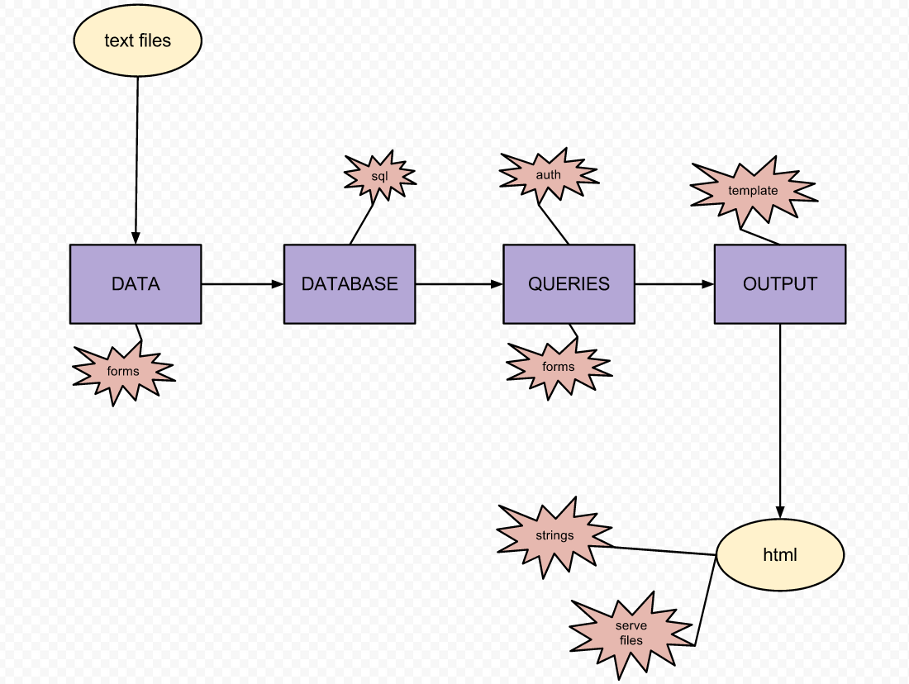
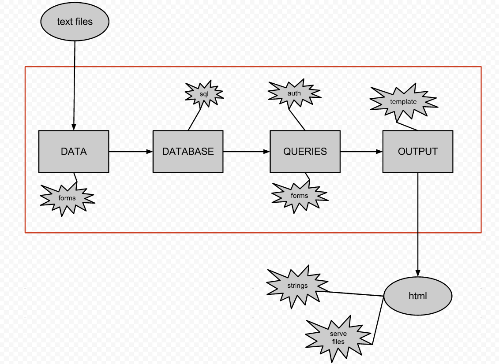

Day 13 -- Tu, Feb 19th, 2013
============================

Rough schedule for today, summary:

 - Discuss the foundation for the drinkz web app
 - Form new pairs
 - Complete in-class exercise about confidence with topics covered in class
 - Complete in-class exercise about WSGI

Web App Foundation
------------------

Thus far in class, we have laid a foundation for building a web
app. We start from text files, turn it into data, collect the data
into an in-memory database allow querying of the database, return
query results, and output everything as html files:

.. image:: files/day13_1.png
   :scale: 75 %

In order to develop the drinkz project, we need to expand on certain
levels of this foundation. Paths from here are:

 * Outputting strings or serving files
 * Converting the data structures to a SQL database
 * Using web forms to get data or query the database
 * Including some form of security/authentication
 * Incorporating templating

        
As we add these functionalities to the drinkz framework, we will see a
web app emerge:

        
Pairs
-----

Today's in-class activities will have assigned groups:

.. csv-table:: 
            :header: "Group #"
            :widths: 10, 15, 15

            1, Eric M, Michael M
            2, Phil G, Marco B
            3, Mike M, Mbozu L
            4, Michelle T, Anthony C
            5, Jacob W, Alex L
            6, Jacob R, Adam P
            7, Jon B, Ryan C
            8, Ryan T, Adam K
            9, Michelle V, Connor G
            10, Nikhil A, Wes W
            11, Jesus R, Austin H
            12, Chris E, Eric Z
            13, Marshal N, Anthony B
            14, Jieping T, David J
            15, James C, David W
            16, Matt S, Chris E
            17, Hassan A, Madalyn P
            18, Yevgeny K, Aaron V
            19, Garrett S, Connor G
            20, Daniel S
            
Groups will meet at the following tables:

    .. image:: files/day13_4.png

WSGI
----

We're going to get started with a real, live Web server, built using
internal libraries from Python.

Running the Web server
~~~~~~~~~~~~~~~~~~~~~~

Log into arctic.cse.msu.edu, and clone the cse491-webz repository from
github/ctb::

   % git clone https://github.com/ctb/cse491-webz.git
   
This repo contains a simple Web server built using the `wsgiref
<http://docs.python.org/2/library/wsgiref.html>`__ module, with a Web
application that follows `the WSGI specification
<http://www.python.org/dev/peps/pep-0333/>`__.  Basically, wsgiref
handles all of the network stuff, while the WSGI application -- here,
the 'SimpleApp' class in 'app.py' -- follows the WSGI application spec
and serves up all the content.  We'll be writing both a WSGI app (the
drinkz stuff) and a WSGI server in this class.

To run the Web server, do::

  % cd cse491-webz
  % python2.7 app.py

and use your browser to go to the URL that is printed out.

Use CTRL-C to exit the app.py Web server.

In-class TODO
~~~~~~~~~~~~~

In pairs, please 

 * read through the app.py source code

 * answer the below questions and be prepared to discuss them with ctb

 * merge your cse491-linkz work (`from Day 12 <http://msu-web-dev.readthedocs.org/en/latest/day12.html#basis-html-output-and-linking-discussion-and-exercise>`__) into the cse491-webz repository, and serve the cse491-linkz stuff via cse491-webz.

Questions:

1. Stop the Web server, modify the HTML printed out next to the top
   page in the Web server ('Visit:' ...), and re-run it. How does your
   Web browser know how to contact *your* app.py instead of your neighbor's?

2. Note that the only content being returned to your Web browser is sent
   from app.py.  Where is the logic in app.py for what is returned, and
   what is returned by default from this logic (i.e. if nothing specific
   is matched, what's the default?)

3. What role does content type play in what is returned?  What happens
   if you return the "wrong" content-type?

4. What variable type is 'data'?

5. What role does 'status' play?  What if you return the "wrong" status?

6. What happens if 'somefile.html' isn't present?

7. How does the Web browser know that 'somefile.html' is HTML, and
   that the GIF file content is an image?

8. Why do we generate a random number at the bottom of the script? What happens
   if you make 'port' a fixed number?

9. How is PATH_INFO generated, ultimately?  (What do you have to change
   in the Web browser to change PATH_INFO?)

10. What happens when you 'print' something from within app.py -- where does
    it print out, and why?

11. When does __call__ in app.py get executed, and how does the server
    know when to eecute it?

Minute Cards
------------

In the last 5 minutes of class, please fill out this `minute card
survey
<https://docs.google.com/spreadsheet/viewform?formkey=dHFMMmg5djBFMTFQV2paSlNtWG94X0E6MQ#gid=0>`__.

